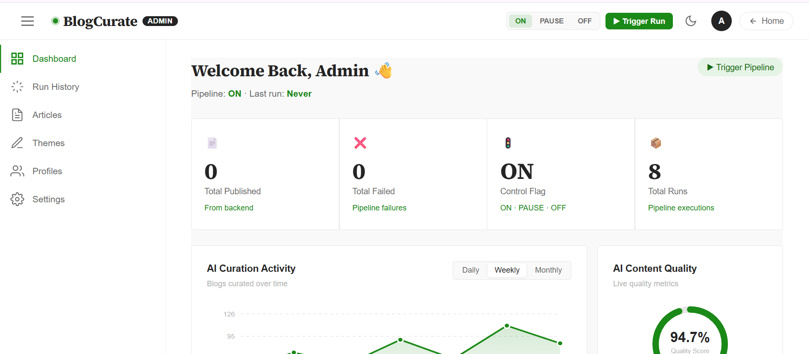
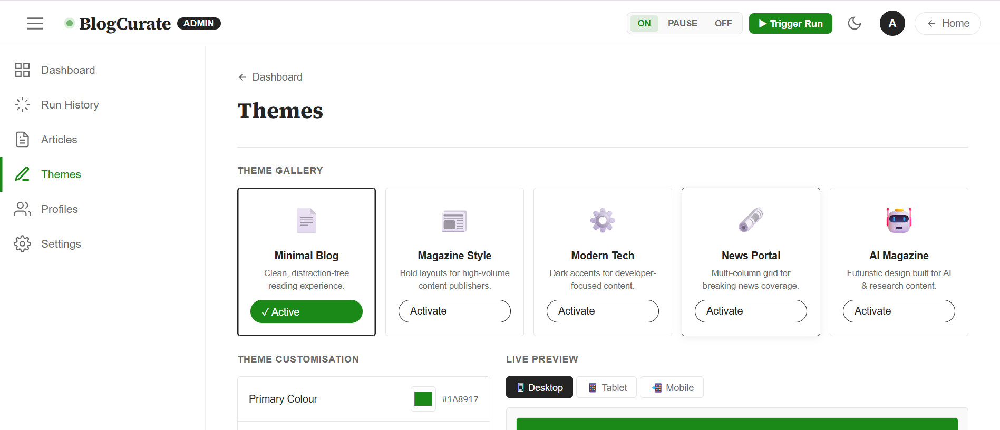
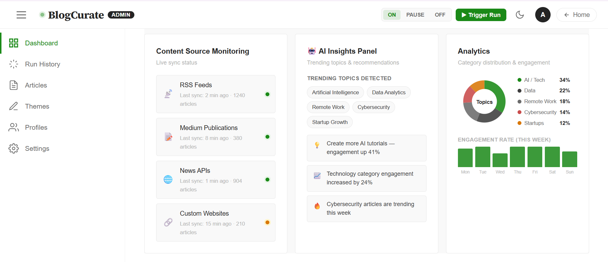
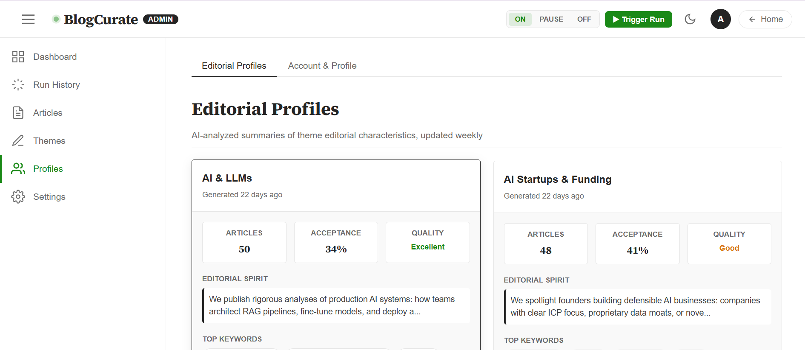
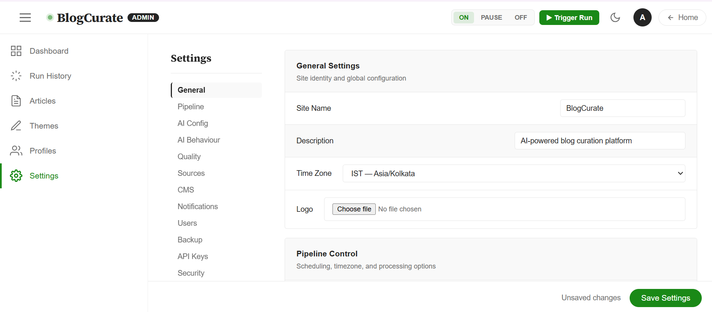
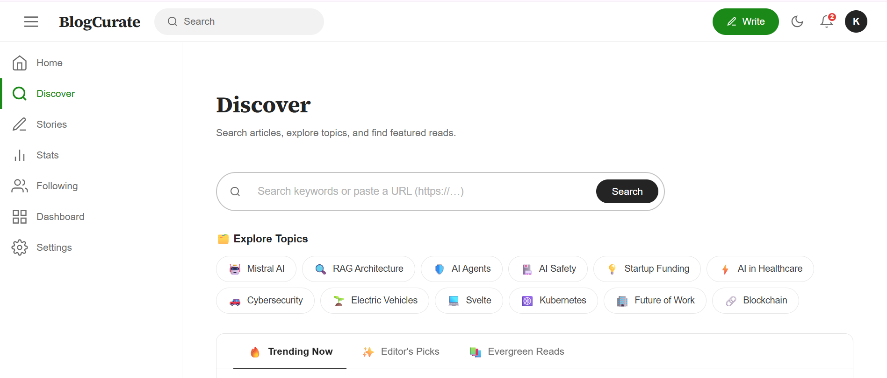

# BlogCuration — AI-Powered Blog Curation Platform

An automated blog curation system that discovers, scores, and publishes articles using a local AI model (Ollama/Mistral). Built with Spring Boot (backend), Svelte (frontend), PostgreSQL, and Redis.

---

## Screenshots

### adminpage


### adminthemes


### dashadmin


### home


### profile


### settings


### userpanel


---

## Tech Stack

| Layer | Technology |
|---|---|
| Frontend | Svelte 5 + Vite |
| Backend | Spring Boot 3.2 (Java 17) |
| Database | PostgreSQL 16 |
| Cache | Redis |
| AI Model | Ollama (Mistral / TinyLLaMA — local) |
| CMS | Strapi (optional) |
| Search | SerpAPI |
| Stock Photos | Unsplash API |
| Build | Maven |
| Containerisation | Docker + Docker Compose |

---

## Project Structure

```
blogcuration/
├── src/                        # Spring Boot backend source
│   └── main/
│       ├── java/com/curation/  # Java source code
│       └── resources/
│           ├── application.yml # Backend configuration
│           └── db/migration/   # Flyway SQL migrations
├── frontend/                   # Svelte frontend
│   ├── src/
│   │   ├── pages/              # Page components
│   │   ├── components/         # Shared UI components
│   │   ├── stores/             # Svelte stores (state)
│   │   └── data/               # Static/mock data
│   ├── .env                    # Frontend env vars
│   └── package.json
├── uploads/images/             # Local image storage
├── docker-compose.yml          # PostgreSQL + Strapi containers
├── pom.xml                     # Maven build config
└── .env.template               # Backend env vars template
```

---

## Prerequisites

- Java 17+
- Node.js 20+
- Maven 3.9+
- Docker Desktop
- Ollama installed locally → [ollama.com](https://ollama.com)

---

## Setup

### 1. Clone the repository

```bash
git clone https://github.com/YOUR_USERNAME/blogcuration.git
cd blogcuration
```

### 2. Configure environment variables

```bash
cp .env.template .env
```

Edit `.env`:

```env
OLLAMA_API_URL=http://localhost:11434/api/chat
OLLAMA_MODEL=tinyllama

SEARCH_API_KEY=your-serpapi-key
STOCK_PHOTO_API_KEY=your-unsplash-access-key

CMS_API_URL=http://localhost:1337
CMS_API_KEY=your-strapi-api-key

DB_USERNAME=postgres
DB_PASSWORD=your-db-password

REDIS_HOST=localhost
REDIS_PORT=6379

MAIL_HOST=smtp.gmail.com
MAIL_PORT=587
MAIL_USERNAME=your-email@gmail.com
MAIL_PASSWORD=your-app-password

ADMIN_EMAIL=your-email@gmail.com
ADMIN_API_KEY=your-admin-api-key
```

```bash
cp frontend/.env.example frontend/.env
```

Edit `frontend/.env`:

```env
VITE_ADMIN_KEY=your-admin-api-key
```

### 3. Pull the AI model

```bash
ollama pull tinyllama
```

---

## Running the Project

### Terminal 1 — Database

```bash
docker compose up -d postgres
```

### Terminal 2 — Backend

```powershell
mvn spring-boot:run "-Dskip.frontend=true"
```

Runs on → `http://localhost:8080`

### Terminal 3 — Frontend

```powershell
cd frontend
npm install
npm run dev
```

Runs on → `http://localhost:5173`

---

## Stopping the Project

```bash
docker compose down
```

Stop Backend and Frontend → `Ctrl+C` in their terminals

---

## Features

- **AI Pipeline** — Automatically discovers, scores, and publishes articles nightly via Ollama
- **Admin Dashboard** — Monitor pipeline runs, manage articles, themes, and editorial profiles
- **AI Behaviour Controls** — Configure writing tone, style, content strategy, personalisation weights
- **User Feed** — Personalised "For You" and "Featured" feeds based on reading history and interests
- **EN/FR Translation** — Toggle between English and French on any article card
- **Discover Page** — Search by keyword or URL, get AI-curated blog post from any article
- **Blog Generation** — Generate and edit AI blog posts, schedule for publishing
- **Pipeline Control** — ON / PAUSE / OFF flags with admin alerts

---

## API Endpoints

| Method | Endpoint | Description |
|---|---|---|
| GET | `/api/articles` | List published articles |
| GET | `/api/pipeline/status` | Pipeline status |
| POST | `/api/pipeline/trigger` | Trigger a pipeline run |
| PUT | `/api/pipeline/flag/{flag}` | Set ON/PAUSE/OFF |
| GET | `/api/pipeline/runs` | Run history |
| GET | `/api/pipeline/themes` | Active themes |
| POST | `/api/pipeline/calibrate/{themeId}` | Calibrate a theme |

All admin endpoints require `X-API-Key` header.

---

## License

MIT
